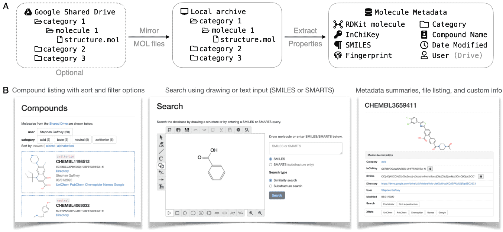

# chemsearch

Chemsearch is web application used to create, browse, and search a chemical 
compounds library. Powered by the cheminformatics toolkit `rdkit`, Chemsearch 
extracts molecular structure from a collection of MOL files, gathers metadata, 
and provides an interface for exploring the library of compounds. To search 
within the library, Chemsearch offers 'search by similarity' and 'search by 
substructure', taking queries in the form of molecular structure drawings 
(using a molecule editor from Kekule.js) or as SMILES or SMARTS strings. Each
compound has a dedicated page which shows molecular structure, summary data, a 
file listing for the corresponding data folder, and custom information (provided
as a Google Doc, markdown file or other text file).

Chemsearch can work with a Google G Suite account for extended functionality.
The app can work with libraries stored in a Google Shared Drive 
(in DRIVE mode) or with a local folder (default mode). Optional access control 
is provided in AUTH mode, with a Google OAuth login page that restricts access 
to members of a specified Google Group.




## Docker image

The quickest way to try out Chemsearch is to use the Docker container image on 
[Docker Hub](https://hub.docker.com/r/cgemcci/chemsearch). With Docker installed 
and running on your machine, run the following command in the terminal to 
download the image and browse the demo library with default settings:
```shell script
docker run --rm -p 5000:5000 cgemcci/chemsearch
```
The app will be accessible in your browser at http://localhost:5000/.

Customizing the app requires additional command arguments that bind a local 
folder of configuration files (see the Configuration section below) 
as well as a folder used for the local data archive.
```shell script
docker run -p 5000:5000 --rm \
 -v /path/to/config/dir:/app/config \
 -v /path/to/archive/dir:/app/demo_db cgemcci/chemsearch
``` 


## Manual setup instructions

After you clone or [download](https://github.com/gem-net/chemsearch/archive/master.zip) 
and unzip the repository, you must install the dependencies. The easiest way to 
install the required Python 3 environment and all dependencies is via Conda.
1. If you don't have `conda` on your system, install [Miniconda](https://docs.conda.io/en/latest/miniconda.html).  
2. In the terminal, navigate to the cloned/downloaded folder.
3. Create a conda virtual environment with all dependencies:
   ```bash
   conda env create -n chemsearch -f environment.yaml
   ```
    - or to create an environment precisely mimicking a tested version, specify 
    `environment.lock.yaml` instead of `environment.yaml` above. 
4. Activate the new environment with `conda activate chemsearch`.
5. [Optional] Install the chemsearch package by running `python setup.py develop` (to 
   install in development mode, allowing the code to be modified.)


### Configuration

With default settings, Chemsearch will serve a demo library, but the app can be 
customized by modifying configuration files in the `config` subdirectory.  

An 'env' file provides the primary configuration detail. A demo env file, 
`demo.env` has been provided, which you should update, rename to `.env`, and place 
in the `config` folder.  

The env file is used to specify non-default options via environment variables:
- root directory for local compounds library (LOCAL_DB_PATH)
- app title, for banner (APP_TITLE, default 'Molecules')
- DRIVE mode status, for use with Google Shared Drive (USE_DRIVE, default 'off')
- AUTH mode status (on/off), for authentication with Google OAuth (USE_AUTH, default 'off')
- Flask settings, if serving using `flask` application server: 
  development vs production mode (FLASK_ENV, default 'production'); 
  port (FLASK_RUN_PORT, default 5000), 
  WSGI script path, FLASK_APP)

To use Shared Drive and/or Authentication modes requires some additional environment variables:

variable | DRIVE mode | AUTH mode | example | notes
-------- | ----------------------- | ---------------------- | ------- | -----
CREDENTIALS_AS_USER | ✅ | ✅ | admin@example.org | (1)
SHARED_DRIVE_ID | ✅ |  | 0AbCdEfG_abc123 | (2)
GOOGLE_CLIENT_ID |  | ✅ | 123456789.apps.googleusercontent.com | (3)
GOOGLE_SECRET |  | ✅ | 98765_abcde | (3)
GROUP_KEY |  | ✅ | 012345abcde | (4)

Notes
1. User email in your domain with Drive access, to use with service account.
2. You can get the Drive ID from the end of the Shared Drive URL, e.g. 
   https://drive.google.com/drive/u/1/folders/ABCDEFG123456789
3. Client and secret correspond to OAuth credentials generated at https://console.developers.google.com/
4. The Group key/ID is shown at the end of the group's URL in the G Suite admin 
   panel, e.g. https://admin.google.com/ac/groups/012345abcde

Shared Drive and Authentication modes also require a service account credentials 
JSON file named `creds.json` in the config directory. For information on how to generate 
the credentials file, see the [wiki](https://github.com/gem-net/chemsearch/wiki/Get-API-Credentials-File).


## Run the server

The WSGI server executables `flask` and `gunicorn` are available after installing 
the dependencies as above, and either can be used to serve the application. 
`flask` is a 'development' server, best suited to testing code changes, while    
`gunicorn` is more production-ready.
 
**FLASK**:
To serve using `flask`, run the following from the top directory of the repository:
```shell script
FLASK_APP=src/chemsearch/chemsearch.py flask run
```
- This can be simplified to `flask run` if you set `FLASK_APP` in the configuration 
file `config/.env`.

**GUNICORN**:
To serve using `gunicorn`, run the following from the top directory of the repository:
```shell script
gunicorn src.chemsearch.chemsearch:app
```
- Note that you can add command arguments to further customize the application 
server, to modify e.g. listening port and number of worker processes.
